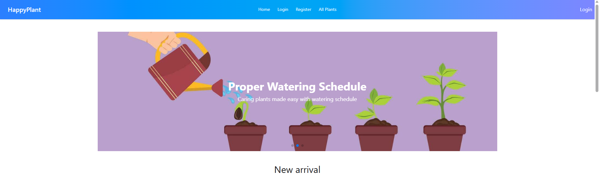

## Project Overview
This is a plant management web application that allows users to log, track, and manage care tasks for their houseplants. Users can add their plants, log watering/fertilizing dates, set reminders, and track plant health. The platform will support user authentication and personal plant data management.

Live Demo

[Live Site Link](https://assignment-10-a27cc.web.app)

---

## 🛠️ Technologies Used

- React
- Firebase Authentication
- Express.js
- MongoDB
- Tailwind CSS
- React Router

---

## ✨ Core Features

- 🔐 Firebase Authentication (Google and email/password)
- 🌱 Add and view your own plants under **My Plants**
- 🌐 Public routes like **Home** and **All Plants** show only default/public plants
- 🔒 User-specific filtering: your plants are hidden from others
- 🔄 Responsive design with Tailwind CSS
- 🧪 Server-client separation with secure API routes

---

## 📦 Dependencies

### Client:

- react
- react-dom
- react-router
- firebase
- tailwindcss
- daisyui

### Server:

- express
- cors
- mongoose
- dotenv
- nodemon (dev)

---

📚 Additional Resources
[Firebase Documentation](https://firebase.google.com/docs)

[MongoDB Documentation](https://www.mongodb.com/docs/)

[React Router](https://reactrouter.com/)

📬 Contact
For questions or feedback, reach out:
[LinkedIn](https://www.linkedin.com/in/syed-sifat2004/) 

